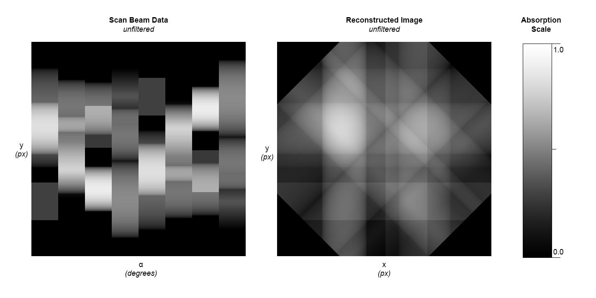

# simple-ct-sim

## Usage

```
$ python3 -m venv env
$ env/bin/activate
$ pip install -r requirements.txt
$ python3 simple-ct-sim.py
```

## Orginal Image


## Computed Images

### 4 Scans (90 deg)


### 8 Scans (45 deg)


### 32 Scans (11.25 deg)


### 256 Scans (1.41 deg)
