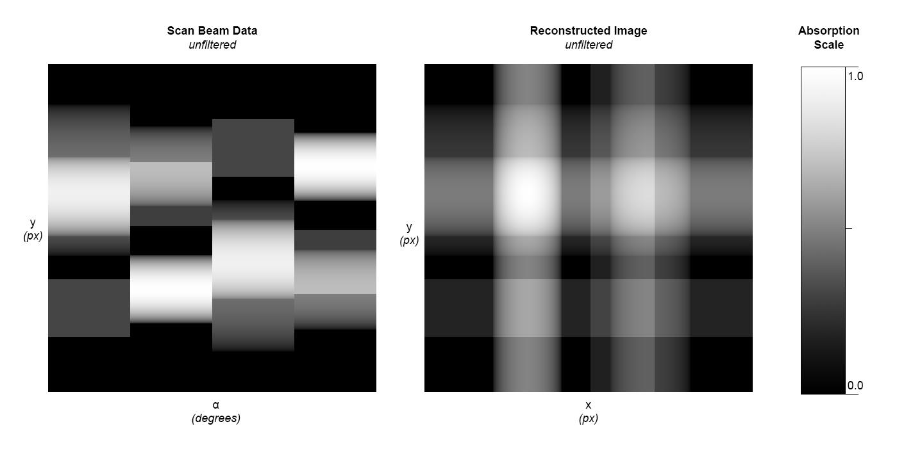
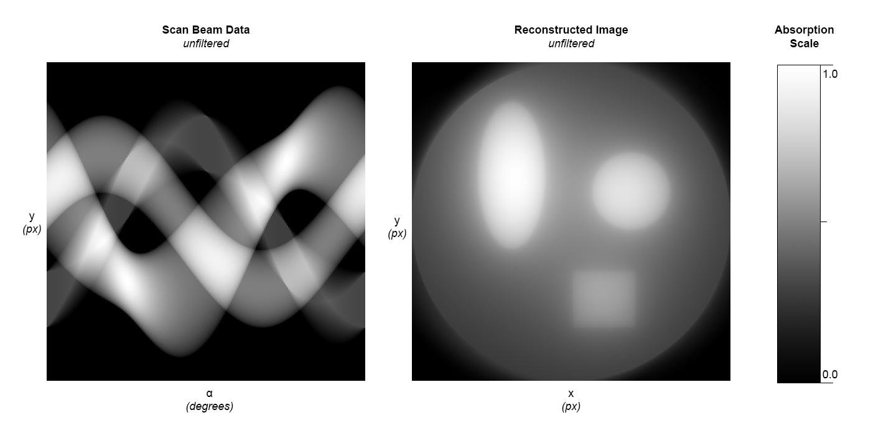

# Simple CT Simulation Python

This program is written in Python and aims to simulate a CT imaging process in
its most basic form. Therfore the input image is taken and scaned horizontally.
The output of this operations will be ouput as scan-beam image with filename 
`ct-scb-p{run}.jpg` or as part of `graph-p{run}.jpg`. No filters get applied to
the reconstructed image. Only the histogram of the reconstruced image will be 
streched to the borders.


## Usage
Options:
```
usage: simple-ct-sim.py [-h] --runs N [N ...] --input INPUT [--output OUTPUT]

simple ct simulation

options:
  -h, --help        show this help message and exit
  --runs N [N ...]  array of simulations that should be run. Number specifies the number of pictures taken in that simulation run.
  --input INPUT     square graylevel, which CT should be simulated on
  --output OUTPUT   output directory for images
```

## Getting started
```
$ git clone https://github.com/hendrikboeck/simple-ct-sim.git
$ cd simple-ct-sim
$ python3 -m venv env
$ ./env/bin/activate
$ pip install -r requirements.txt
$ python3 simple-ct-sim.py --input import/org.png --ouput export --runs 24 32
```

## Examples

### Orginal Image
<div align="center">
  
</div>

### Simulated CT Images

#### Run with 4 images taken (90 deg)
```
$ python3 simple-ct-sim.py --input import/org.png --ouput export --runs 4
```
<div align="center">
  
</div>

#### Run with 32 images taken (11.25 deg)
```
$ python3 simple-ct-sim.py --input import/org.png --ouput export --runs 32
```
<div align="center">
  
</div>

#### Run with 256 images taken (1.41 deg)
```
$ python3 simple-ct-sim.py --input import/org.png --ouput export --runs 256
```
<div align="center">
  
</div>